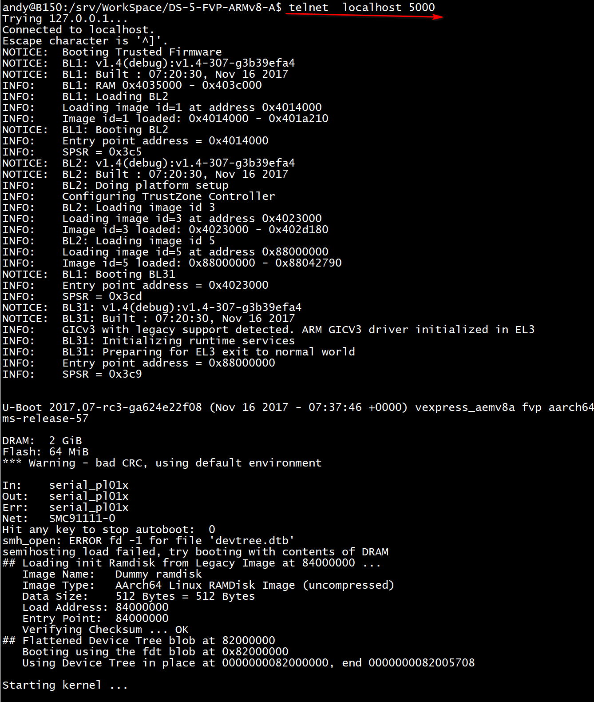

# Run Linux Kernel for ARMv8-A  with DS-5 FVP


To develop, port and debug the Linux kernel on a platform, you will need to be able to set breakpoints, view registers, view memory, single-step at source level and so on - all the normal facilities provided by a debugger.  You may also need to do these both *before* the MMU is enabled (with a physical memory map), and *after* the MMU is enabled (with a virtual memory map). DS-5 Debugger in [Arm DS-5 Development Studio](https://developer.arm.com/products/software-development-tools/ds-5-development-studio) allows you to do all this and more, not just for single-core platforms, but for multi-core SMP platforms too.

Fist of all, you need install a DS-5 on your computer, [DS-5](https://developer.arm.com/tools-and-software/embedded/legacy-tools/ds-5-development-studio/editions) Ultimate Edition is recommended.

This blog shows how to debug the Linux 4.12.0 kernel from the Linaro 17.10 distribution, running on a Armv8-A [Fixed Virtual Platform](https://developer.arm.com/products/system-design/fixed-virtual-platforms) (FVP) model – the AEMv8Ax4 (FVP_Base_AEMv8A). The model is supplied with DS-5 Ultimate Edition. The Armv8-A Linux kernel, pre-built for debug, complete with vmlinux symbol file, file system, and full source code, are required for this tutorial. The boot loader used here is the Trusted Firmware and U-Boot.


*Screen-shot of post-MMU source-level debug*

DS-5 Debugger has a slick Debug Configuration dialog in Eclipse that makes it easy to configure a debugging session to a target. The **Linux Kernel Debug** configuration type is primarily designed for post-MMU debug to provide full kernel awareness but, with some extra controls, can also be used for pre-MMU debug too. This makes it possible to debug the Linux kernel, from its entry point, through the pre-MMU stages, and then seamlessly through the MMU enable stage to post-MMU debug with full kernel awareness, all the way to the login prompt, all with source-level symbols, and all without the need for tedious disconnecting, reconfiguring and reconnecting.

## Enabling the Telnet Client

FVP models make use of "telnet" as a serial terminal, to transfer serial data from application code running on the FVP model via a modelled UART. The telnet client is not enabled by default on Windows 7 and later. If the telnet client is disabled on your computer, you may see the error: “Windows cannot find C:\Windows\System32\telnet.exe” or “No telnet executable was found on your system”.

To enable the telnet client:

1. Right-click on the Start menu, then select **Settings**
2. Search for **Telnet**, and select **Turn Windows features on or off**
3. From the list that appears, tick the **Telnet Client** checkbox
4. Click **OK** to close the dialog.

On Linux development environment such as Ubuntu, you should make sure **xterm** and **telnet** are installed  or you will see errors like `sh: 1: xterm: not found`  when FVP startup.

## Setting up Linux on the AEMv8A model

This section describes how to obtain the pre-built Linaro Linux distribution and launch the AEMv8A model. This does not need to be done if you intend to debug Linux on real hardware that has Linux already installed.

1. First download the pre-built (debug) Armv8-A Linux software stack, including file system and kernel source tree, from Linaro, using the [instructions for using Linaro deliverables on an FVP](https://community.arm.com/dev-platforms/w/docs/228/armv8-a-fvps). This example uses the Linaro 17.10 "[64-bit] AEMv8-A Base Platform FVP" platform with "[DEBUG] latest-armlt + OpenEmbedded Minimal 15.09" software stack and file system. Your can get if from [Arm Reference Platforms Deliverables 17.10](https://community.arm.com/developer/tools-software/oss-platforms/w/docs/226/old-release-notes), of course you can also get them from my github.
2. To debug at source-level, the Linux kernel source tree is needed. This example uses Linux 4.12.0. On Linux hosts, the kernel sources can be obtained using the instructions in the previous step. On Windows hosts, the kernel sources can be obtained from [linux.org](https://www.kernel.org/pub/linux/kernel/v4.x/)
3. On Windows hosts, from the Start menu, open a DS-5 Command Prompt, then navigate to the folder where the Armv8-A Linux images were saved, for example, `...\fvp-latest-oe-uboot.`
   On Linux hosts, navigate to the folder where the Armv8-A Linux images were saved
4. Launch the AEMv8A model with all the parameters needed to boot Linux with:

```
FVP_Base_AEMv8A -C bp.secure_memory=0 -C cache_state_modelled=0 -C bp.pl011_uart0.untimed_fifos=1 -C bp.secureflashloader.fname=bl1.bin -C bp.flashloader0.fname=fip.bin --data cluster0.cpu0=Image@0x80080000 --data cluster0.cpu0=fvp-base-aemv8a-aemv8a.dtb@0x82000000 --data cluster0.cpu0=ramdisk.img@0x84000000 -C bp.ve_sysregs.mmbSiteDefault=0 -C bp.virtioblockdevice.image_path=..\lt-vexpress64-openembedded_minimal-armv8-gcc-4.9_20150912-729.img -C bp.smsc_91c111.enabled=true -C bp.hostbridge.userNetworking=true -C bp.hostbridge.userNetPorts="5555=5555,8080=8080,22=22" --cadi-server
```

The `--cadi-server` parameter tells the model to wait for a debugger to be connected.

To capture instruction execution history ("trace") too, add, e.g.:

`--plugin="C:\Program Files\DS-5 v5.28.0\sw\models\bin\MTS.dll"` (Windows)

 `--plugin=".../DS-5 v5.28.0/sw/models/bin/MTS.so"` (Linux)


Then we can start a telnet on host computer  to capture the boot log from terminal_0:

```
telnet  localhost 5000
```


## Creating a Debug Configuration

The following sequence is for using DS-5 on a Windows host, but Linux is the same except for the pathnames.

1. Launch **Eclipse for DS-5**, select a Workspace, then switch to the **DS-5 Debug** perspective, using the **Open Perspective** control in the top right-hand corner of the window.
2. Select **Run > Debug Configurations…** to open the Debug Configurations dialog.
3. In the left-hand column of the **Debug Configurations** dialog, select **DS-5 Debugger,** then click on **New launch configuration** (icon in top left corner) to create a new Debug Configuration. Give it a name, for example, “**Armv8-A Linux Kernel Debug**”.


*Debug Configuration for Linux Kernel Debug on AEMv8Ax4 FVP*

1. In the **Connection** tab, type “**AEM**” in the **Filter Platforms** filter so that only the matching platforms are shown, then select **ARM FVP (Installed with DS-5) > Base_AEMv8Ax4 > Linux Kernel and/or Device Driver Debug > Debug ARMAEMv8-A_x4 SMP.** This tells the debugger which processors to connect to (here, quad Armv8-A SMP cores), and to select Linux OS-aware debugging.

2. To capture instruction execution history ("trace") [optional], press the **DTSL Options** “**..**” button. In the **Trace Configuration** tab, select the **Trace capture method** as **Fast Models Trace**, then **OK.**

3. In the **Debugger** tab, select the **Run Control** as **Connect only**.

   The model is ready to run, but here we don’t want it to start running to main() or other symbol on connection, so the debugger should only connect.

4. In the **Debugger** tab, tick **Execute debugger commands**, then enter this command into the field:
   **thbreak EL2:0x80080000**

   This command sets a temporary hardware breakpoint at address 0x80080000. This is the physical address at which the kernel is loaded and is also the code execution entry point for the kernel.  This address comes from the model parameter: --data cluster0.cpu0=Image@0x80080000, which matches the U-Boot environment variable kernel_addr. You may need to change this breakpoint address to match your own kernel.

5. Alternatively, instead of launching the model from the command-line with the -C model parameters as shown earlier, you can launch the model from DS-5 Debugger by adding the -C model parameters into the **Model parameters** field at the foot of the **Connection tab**. DS-5 Debugger will automatically tell the model to start a CADI server to enable a debug connection, so there is no need to include the --cadi-server.

## Running to the Entry Point of the Kernel

1. At the bottom right of the Debug Configurations dialog, click on **Debug** to connect DS-5 Debugger to the model. The connection information in the **Commands** view shows the target is initially stopped at the entry point of the Trusted Firmware - address 0x0 in EL3:


*Example of the target being stopped at the entry point of the Trusted Firmware*

1. Start the target running by pressing the green **Continue** button in the **Debug Control** view, or press **F8**. 
   The model will start by running the Trusted Firmware, then U-Boot. U-Boot then jumps to the entry point of the kernel. Wait a few seconds for the breakpoint at the entry point of the kernel to be hit.



*Example of the breakpoint at the entry point of the kernel*

1. Code execution stops on the entry point of the kernel in EL2 (corresponding to the symbol “efi_head”). Notice in the **Debug Control view** that execution has stopped on Core 0 of the SMP cluster – the other cores are powered down. You should see in the Commands view: 

   Execution stopped in EL2h mode at breakpoint 1: EL2:0x0000000080080000
   On core ARMAEMv8-A_MP_0 (ID 0)
   EL2:0x0000000080080000   ADD      x13,x18,#0x16

2. The “efi_head” veneer comprises an ADD instruction followed by a branch. The ADD instruction has no meaningful effect except that its opcode forms a magic signature required by UEFI.  **Single-step** twice (press **F5**, **F5**) to reach EL2: 0x80B00000 (this corresponds to the symbol “stext”, the main entry point of the kernel).

## Debugging the Kernel : Pre-MMU Stage

1. Code execution is stopped at the breakpoint, and the Disassembly view shows the assembly code, but no source code is shown yet, because the vmlinux symbols have not yet been loaded. In the **Command** entry field (at the bottom of the **Commands** view) enter:
   **set os physical-address 0x80080000****add-symbol-file "path\to\vmlinux"**

   Fix-up the “\path\to” to point to the real folder on your hard-disk where the vmlinux file can be found, for example, inside fvp-latest-oe-debug.

   Explanation: Debug symbols in the vmlinux file have *virtual* addresses, so can normally only be used to debug when Linux is up and running with the MMU enabled. To debug pre-MMU *physical* addresses at source-level, an offset must be applied to the addresses in the vmlinux file. The offset between the physical and virtual addresses is calculated by DS-5 Debugger using the physical address given in the **set os physical-address** command and the virtual address read from the ELF header of the vmlinux file. The physical address at which the kernel is loaded comes from the model parameter: --data cluster0.cpu0=Image@0x80080000, which matches the U-Boot environment variable kernel_addr. You may need to change the address given with the **set os physical-address** command to match your own kernel.

   Check the following appears in the Command view, to confirm Linux kernel support has been enabled:
   Enabled Linux kernel support for version "Linux 4.12.0 #1 SMP PREEMPT Thu Nov 16 07:37:36 UTC 2017 aarch64"

   Symbol names now appear in the Disassembly view, with the PC at the symbol stext.

1. DS-5 Debugger will try to open .../arch/arm64/kernel/head.S in its Editor view. If it does not find the kernel sources in paths relative to those specified in the vmlinux file, a button appears inviting you to set a path substitution:

   

   Press on the button to open a dialog to set a substitute source path, to re-direct paths from where the kernel was built to where the kernel source tree is located on your hard-disk.

   

   If you need to revisit these paths later, this dialog can be opened by clicking on **View Menu** (the upside-down triangle) on the Debug Control view toolbar, then selecting **Path Substitution…**

1. That’s all the set-up now done. You can now view registers, view variables, view memory, set breakpoints and watchpoints, single-step, and all the other usual debug operations at this **pre**-MMU stage, all at source level.

   

   *Screen-shot of pre-MMU source-level debug*

   In the **Registers** view, expand **AArch64**, then expand the **Core** and **System** register groups.

   At the kernel entry point, you can check the Core and System registers are set as recommended by: [Booting AArch64 Linux post on the Kernel.org site](https://www.kernel.org/doc/Documentation/arm64/booting.txt)

   - Primary CPU general-purpose register settings
     X0 = physical address of device tree blob (dtb) in system RAM (=0x82000000)
     X1 = 0 (reserved for future use)
     X2 = 0 (reserved for future use)
     X3 = 0 (reserved for future use)

   - CPU mode
     All forms of interrupts must be masked in PSTATE.DAIF (Debug, SError, IRQ and FIQ).
     You can check this in **AArch64 > System > PSTATE > DAIF**
     The CPU must be in either EL2 (recommended in order to have access to the virtualisation extensions) or non-secure EL1.
     You can check this in **AArch64 > System > PSTATE > Mode**
     or by typing:
     **output $AARCH64::$System::$PSTATE::$Mode.M**

   - Caches, MMUs
     The MMU must be off - see **AArch64** > **System** > **Other** > **SCTLR_EL2.M**Instruction cache may be on or off - see **AArch64** > **System** > **Other** > **SCTLR_EL2.I**Data cache is off - see **AArch64** > **System** > **Other** > **SCTLR_EL2.C**

1. The kernel code here executes in EL2, and the kernel symbols have been loaded for EL2, but most of the kernel code later runs in EL1N. To see where the change from EL2 to EL1N occurs, search head.S using **Edit > Find/Replace…** for the ‘eret’ instruction. It is at the end of ‘el2_setup’:

   `:``   mov   w0, #BOOT_CPU_MODE_EL2        // This CPU booted in EL2   eretENDPROC(el2_setup)`

   Double-click on the far left-hand side of the ‘eret’ line to set a breakpoint, then **Continue** (or press **F8**) running to it. The processor is still currently in EL2:

   Execution stopped in EL2h mode at breakpoint 1: EL2:0x00000000808BC138
   On core ARMAEMv8-A_MP_0 (ID 0)
   EL2:0x00000000808BC138   527,0   eret

   Now single **Step Source Line** (or press **F5**). The processor switches to EL1N:

   Execution stopped in EL1h mode at EL1N:0x0000000080B00008
   On core ARMAEMv8-A_MP_0 (ID 0)
   In head.S
   EL1N:0x0000000080B00008   119,0   adrp x23, __PHYS_OFFSET

   DS-5 Debugger automatically reloads the vmlinux symbols, and applies them to the EL1N pre-MMU memory space. The Editor view updates automatically using these new symbols to show the correct position of the PC in the source file head.S.

1. To see where the MMU will be turned on, set a breakpoint with: 
   **thbreak __enable_mmu**then **Continue** running (or press **F8**).

   Note: in earlier kernels, this function was named __turn_mmu_on.  In some even earlier kernels, it had file-static scope, so a special notation was needed:
   **thbreak EL1N:("head.o"::__turn_mmu_on)**

   The instruction trace shows the history of instruction execution to reach this point – feel free to explore this view here.

   

   When __enable_mmu is reached, the value in register **x27** will contain the virtual address of __mmap_switched, where the code will jump to after the MMU is enabled.

1. Single-step through to the "msr sctlr_el1, x0" instruction. In the **Registers** view, check **AArch64 > System > Other > SCTLR_EL1**, M bit that the MMU is still off

2. Single-step the "msr sctlr_el1, x0" instruction, and see the M bit change to 1 showing the MMU is now on

3. To see the transition to high-address space (0xFFFFFF8xxxxxxxxx) continue single-stepping until __primary_switched is reached.

   Note: in earlier kernels, this function was named __mmap_switched.

   DS-5 Debugger detects this transition and automatically reloads the vmlinux symbols, and applies them to the EL1N post-MMU memory space (with a zero offset).

## Debugging the Kernel : Post-MMU Stage

You can now view registers, view variables, view memory, set breakpoints and watchpoints, single-step, and all the other usual debug operations at this *post*-MMU stage, all at source level. 

1. The main C code entry into the kernel, after all the architecture-specific setup has been done, is start_kernel() in /source/init/main.c. Set a breakpoint on it with:
   **thbreak start_kernel** then **Continue** (**F8**) running to it.

1. Set the next breakpoint with:
   **thbreak kernel_init** then **Continue** (**F8**) running to it.

So far, CPU 0 has been doing all the work – the other (“secondary”) CPUs are still “asleep” (in WFI) awaiting an interrupt. You can check this by selecting one of the other cores in the Debug Control view. The next steps explore the release of the secondary processors.

1. Secondary processors are released from their holding pen by CPU0 executing smp_prepare_cpus(). Set a breakpoint on this with:
   **thbreak smp_prepare_cpus** then **Continue** (**F8**) running to it.

   In the Debug Control view, notice that Core 0 is in C code with its MMU on, and has started some threads, but the other cores are still “asleep” awaiting an interrupt (WFI) with their MMU off.  

   Set a breakpoint (note: **not** a temporary one this time) with:
   **hbreak secondary_start_kernel** then **Continue** (**F8**) running to it.

   In Debug Control view, notice that Core 1 has woken up and has stopped at the breakpoint.
   Run again.  Core 2 will hit the same breakpoint. 
   Run again.  Core 3 will hit the same breakpoint.  All secondary CPUs have now been released from the holding pen. The secondary CPUs all then enter cpu_do_idle() until the primary CPU gives them some work to do.

   Many of the above steps can be automated, either with a script file, or by filling-in the Debug Configuration's fields before launching.

1. The same Linux version information as was automatically reported earlier can also be reported again manually with:
   **info os-version** which will show, for example:
   Operating system version: Linux 4.12.0 #1 SMP PREEMPT Thu Nov 16 07:37:36 UTC 2017 aarch64

   This is similar to:
   **output init_nsproxy.uts_ns->name**
   which will show, for example:
   {sysname = "Linux", nodename = "(none)", release = "4.12.0", version = "#1 SMP PREEMPT Thu Nov 16 07:37:36 UTC 2017", machine = "aarch64", domainname = "(none)"}

1. When OS awareness is enabled and kernel symbols are loaded from the vmlinux file, DS-5 Debugger will try to access some locations in the kernel. For example, it will try to read uts_ns->name to get the kernel name and version. It will also set breakpoints automatically on SyS_init_module(), SyS_finit_module() and SyS_delete_module() to trap when kernel modules are inserted (insmod) and removed (rmmod). You will see these "Debugger Internal SW" breakpoints appearing in the Breakpoints view:


## Debugging the Kernel : Thread awareness

Now that the kernel is up and running, you can debug with full thread awareness.

1. The Debug Control view is currently showing the cores, but can be changed to show the threads. In the Debug Control view, either click on the **Display Threads** button in the toolbar, or right-mouse-click on the connection, then select **Display Threads**. The current thread (“swapper”), “Active Threads” and “All Threads” appears in the Debug Control view.

   

   Note the context for the (linked) Trace view changes from “core” to “thread” too, so that you can now see in the Trace view the instructions that were executed for the current thread.

1. A useful feature during kernel bring-up is to be able to view earlyprintk (also known as bootconsole) and regular Console output, in particular, if the console is not enabled (so there would be no output from the serial port), or if you have no serial port connected. The entire log so far can be viewed with:
   **info os-log**

   

   *Screen-shot of log capture in progress*

   To view the log output line by line, as it happens, use:
   **set os log-capture on**

1. In the Debug Control view, expand “Active Threads” and “All Threads”. In “All Threads”, you will see several threads/processes have been created. Only four are actually running, one on each of the four cores - you can see these in “Active Threads”. You can view the state of the cores, threads and processes on the command-line with:
   **info cores**

   **info threads**

   **info processes**

1. It is possible to single-step a core or a thread/process. To do so, select either the core or the thread/process in the **Debug Control** view, then press “Step” (F5). Note that when single-stepping through a process, it might get migrated to another core.  If a breakpoint is set on a process, DS-5 Debugger can track the migration of process-specific breakpoints to the other core.

2. To view the kernel’s Task Control Block, first check the kernel’s stack size with:
   **show os kernel-stack-size**

   For this Armv8-A kernel, the kernel stack size is 16K.

   In the **Expressions** view, add a new expression into the field (type in the field at the bottom on the view): 
   **(struct task_struct\*)($SP_EL0)**Note: for earlier kernels, use **(struct thread_info\*)($SP_EL1 & ~0x3FFF)**0x3FFF is 16K minus 1. Expand the tree structure to explore its contents. The list of threads in the Debug Control view is created from the same information, so they should match. For example, the current thread name is held in the structure member comm.


1. The next steps give a simple view into the workings of the scheduler.
   Clear all existing breakpoints, then set a breakpoint:
   **hbreak schedule** then **Continue** (**F8**) running to it.  
   At the breakpoint, **Continue** (**F8**) running again and again, and see the names of the active threads changing in “Active Threads”, and different threads being scheduled-in.


1. Delete all your breakpoints, then **Continue** (**F8**) running, and let the kernel run all the way to the Linux prompt. The four Linux penguin ("Tux") mascots will appear on the model’s LCD screen, and boot log messages will be displayed in the terminal.
   

   

2. Interrupt (**F9**) execution, place a breakpoint on do_fork(), then restart. If nothing forks, force a fork by typing 'ls'.


In summary, we have looked at how DS-5 can be used to debug the Armv8-A Linux kernel, at both pre-MMU enable and post-MMU enable stages, and looked at a few of the kernel’s internal features.

Please see the [DS-5 tutorials](https://developer.arm.com/products/software-development-tools/ds-5-development-studio/resources/tutorials-index) for other approaches for debugging and optimization of your Arm-based projects.